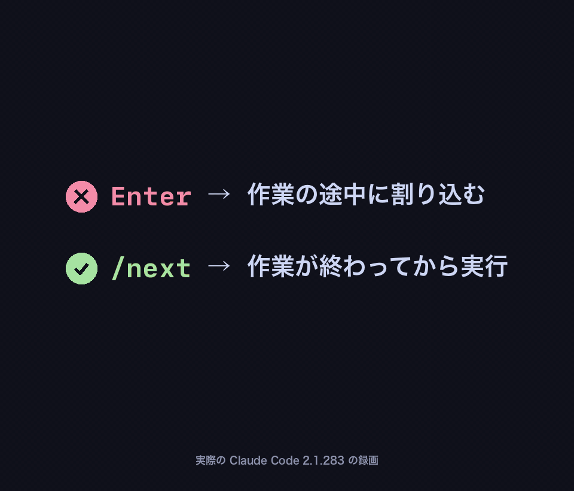

<div align="center">

# /next

**Claude Code の作業中に、次の依頼を予約できます。今の作業は邪魔しません。**

[English](README.md) · [한국어](README.ko.md) · 日本語



</div>

## インストール

```bash
npx claude-next-skill
```

または、以下を Claude Code（ほかのコーディングエージェントでも可）に貼り付ければ、自動でインストールしてくれます。

```text
Claude Code 用の /next スキルをインストールして。`npx -y claude-next-skill` を実行すればいい。
npx が使えない場合は https://raw.githubusercontent.com/Seokwoooo/claude-next/main/skills/next/SKILL.md をダウンロードして、内容を変えずに ~/.claude/skills/next/SKILL.md として保存して。
終わったら、Claude Code のセッションを新しく開くように教えて。
```

インストール後は Claude Code のセッションを新しく開いてください。

## 使い方

Claude の作業中に、こう入力します。

```text
/next テストを実行して、失敗したものを直して
```

今のターンが終わるまで待ってから、新しいターンとして実行されます。

- **複数予約する：** 1つ入力するたびに Enter を押します。入力した順に1つずつ実行されます。
- **取り消す：** 入力欄が空のときに `↑` を押し、その行を消して Enter を押します。このとき `Ctrl+C` は使わないでください。Claude の作業が止まります。

## なぜ必要か

Claude の作業中に送った通常のメッセージは、実行中のツール呼び出しが終わった時点で、作業の途中に Claude へ渡されます。スラッシュコマンドはターンが終わるまで待ちます（[公式ドキュメント](https://code.claude.com/docs/en/interactive-mode#when-claude-code-sends-what-you-queued)）。`/next` はこの仕組みを使った1行だけのスキルです。

<details>
<summary><b>仕組み</b></summary>

スキルの中身はこれだけです（[`skills/next/SKILL.md`](skills/next/SKILL.md)）。

```markdown
---
name: next
description: Queue a follow-up request that runs after the current turn finishes.
argument-hint: <next request>
disable-model-invocation: true
---

Treat the following as the user's follow-up request and carry it out now, continuing from the current conversation: $ARGUMENTS
```

- 待つのは Claude Code のコマンドキューです。スキルは自分の番が来たときに依頼を渡すだけです。
- `disable-model-invocation: true` なので、実行できるのはユーザーだけです。Claude はスキル一覧でこのスキルを見られず、使うまではコンテキストも消費しません。
- 本文は英語ですが、依頼は入力した言語のまま渡されます。

</details>

<details>
<summary><b>更新・削除・手動インストール</b></summary>

- 更新：`npx claude-next-skill` をもう一度実行します。
- 削除：`npx claude-next-skill uninstall`
- Node なしでインストール：[`skills/next/SKILL.md`](skills/next/SKILL.md) を `~/.claude/skills/next/SKILL.md` として保存します（Windows では `%USERPROFILE%\.claude\skills\next\SKILL.md`）。

</details>

<details>
<summary><b>検証</b></summary>

[`tests/verify.sh`](tests/verify.sh) は tmux の中で実際の Claude Code セッションを起動します。複数ステップの作業中に `/next` を2つ入れ、セッションの記録を読んで、何がいつ Claude に届いたかを確認します。Claude Code 2.1.283（macOS）で通過しています。

```text
✓ both /next were queued during the first turn (2/2)
✓ neither /next reached Claude during the first turn (leaks: 0)
✓ the second /next didn't reach Claude during the first /next (leaks: 0)
✓ each /next ran as its own turn (2/2)
✓ reply order: FIRST_DONE -> SECOND_DONE -> THIRD_DONE
```

Claude Code を更新したら、もう一度実行してください（`tmux` と `jq` が必要）。

</details>

<details>
<summary><b>制限</b></summary>

- 待つのはメインのターンの終了までです。Claude がバックグラウンドで動かしている作業の完了までは待ちません。
- 権限の確認はそのまま適用されます。
- 個人スキルなので、自分のマシンのローカルセッションでのみ動作し、クラウドセッションでは使えません。

</details>

## ライセンス

[MIT](LICENSE)
