<div align="center">

# /next

**Claude Code の作業中に、次の依頼を予約できます。今の作業は邪魔しません。**

[English](README.md) · [한국어](README.ko.md) · 日本語



</div>

## なぜ必要か

Claude が作業の途中で、次に頼みたいことがもう決まっている。入力して Enter を押します。

このメッセージは待ってくれません。Claude Code は実行中のツール呼び出しが終わった時点で、**作業の途中に**このメッセージを Claude に渡します。Claude は1つのターンで2つの依頼を同時に抱えることになり、返答も混ざって返ってきます。

スラッシュコマンドは扱いが違います。Claude Code はコマンドを**今のターンが終わるまで保留し**、入力した順に1つずつ実行します（[公式ドキュメント](https://code.claude.com/docs/en/interactive-mode#when-claude-code-sends-what-you-queued)）。`/next` はこのキューを利用する1行だけのスキルです。

| Claude の作業中に入力すると | Claude に届くタイミング | 結果 |
|---|---|---|
| `リリースノートを書いて` ⏎ | 実行中のツール呼び出しの直後、**作業の途中** | 2つの依頼を1つのターンでまとめて処理 |
| `/next リリースノートを書いて` ⏎ | **ターンが終わった後** | 順番どおり、独立したターンで実行 |

## 実際の画面

同じ作業、同じ依頼で録画した実際の Claude Code 2.1.283 のセッションです。

### ✕ Enter


依頼は `lint` の直後、`test` と `build` が走る前に届きます。要約とリリースノートが1つの返答に混ざって返ってきます。

### ✓ /next


`lint`、`test`、`build` が走っている間、依頼は薄く表示されたまま待ちます。作業が終わると新しいターンとして実行されます。

## インストール

クローン不要の1行コマンド:

```bash
mkdir -p ~/.claude/skills/next && curl -fsSL https://raw.githubusercontent.com/Seokwoooo/claude-next/main/skills/next/SKILL.md -o ~/.claude/skills/next/SKILL.md
```

または、クローンしてリンクします。`git pull` するだけで最新の状態に保てます。

```bash
git clone https://github.com/Seokwoooo/claude-next.git
cd claude-next && ./install.sh     # 削除: ./install.sh --uninstall
```

Windows では [`skills/next/SKILL.md`](skills/next/SKILL.md) を `%USERPROFILE%\.claude\skills\next\SKILL.md` として保存してください。

インストール後、Claude Code のセッションを新しく開いて `/next` と入力します。

## 使い方

```text
/next テストを全部実行して、失敗したものを直して
```

- **複数予約する。** `/next` ごとに Enter を押してください。入力した順に、それぞれ独立したターンとして実行されます。前の依頼がツール呼び出しも含めて終わるまで、次の依頼は届きません。
- **取り消す・直す。** 入力欄が空のときに `↑` を押すと、キューにある依頼がすべて入力欄に戻ります（1行に1つ）。不要な行を消して（`Ctrl+U` で1行削除、macOS のターミナルでは `Cmd+Backspace` も可）Enter を押すと残りが再予約されます。入力欄を空のままにすれば全部取り消せます。
  - Claude の作業中に入力欄を消そうとして `Ctrl+C` を押さないでください。作業が中断されます。
  - 再予約した行は**1つの**項目にまとめられます。1行なら問題ありませんが、複数を別々に実行したい場合は1つずつ入れ直してください。
- **早めに切り上げる。** `Esc` で今のターンを中断すると、予約した `/next` がすぐに実行されます。
- `/next` はメッセージの先頭にあるときだけコマンドとして認識されます。

## 仕組み

スキルの中身はこれだけです。

```markdown
---
name: next
description: Queue a follow-up request that runs after the current turn finishes.
argument-hint: <next request>
disable-model-invocation: true
---

Treat the following as the user's follow-up request and carry it out now, continuing from the current conversation: $ARGUMENTS
```

- **待つのはスキルではありません。** ターンが終わるまで `/next` を保留するのは Claude Code のコマンドキューです。スキルは自分の番が来たときに依頼を渡すだけなので、監視や保存の仕組みは要りません。
- **実行できるのはユーザーだけ。** `disable-model-invocation: true` により、Claude はスキル一覧でこのスキルを見ることも、自分で呼び出すこともできません。説明文もコンテキストを消費しません。
- **コンテキストは最小限。** 先頭の設定部分（frontmatter）は Claude に送られません。`/next` が実行されると、Claude が受け取るのは本文の1行とあなたの依頼だけです。
- 本文は英語ですが、依頼は入力した言語のまま渡されます。

## 検証

[`tests/verify.sh`](tests/verify.sh) は tmux の中で実際の対話型 Claude Code セッションを起動します。複数ステップの作業が走っている間に `/next` を2つキューに入れ、セッションの記録を読んで、何がいつ Claude に届いたかを確認します。

```text
✓ first turn ended with FIRST_DONE
✓ both /next were queued during the first turn (2/2)
✓ neither /next reached Claude during the first turn (leaks: 0)
✓ the first /next used tools (2 tool calls)
✓ the second /next didn't reach Claude during the first /next (leaks: 0)
✓ each /next ran as its own turn (2/2)
✓ reply order: FIRST_DONE -> SECOND_DONE -> THIRD_DONE
PASS
```

Claude Code 2.1.283（macOS）で通過しています。比較のため通常のメッセージを同じ方法で入れたところ、最初のツール呼び出しの直後に届きました。Claude Code を更新したら `tests/verify.sh` をもう一度実行してください。`tmux` と `jq` が必要で、Haiku なら1分ほどで終わります。

## 制限

- 「終わった」とは**メインのターンが終わった**という意味です。Claude がバックグラウンドで動かしているコマンドやエージェントは、まだ実行中かもしれません。
- 権限の確認はそのまま適用されます。`/next` で承認を省略することはできません。
- 個人スキル（`~/.claude/skills`）なので、自分のマシンのローカルセッションでのみ読み込まれます。クラウドセッションでは使えません。
- Claude Code のコマンドキューに依存しています。将来のバージョンで挙動が変わった場合は `tests/verify.sh` が検出します。

## ライセンス

[MIT](LICENSE)
