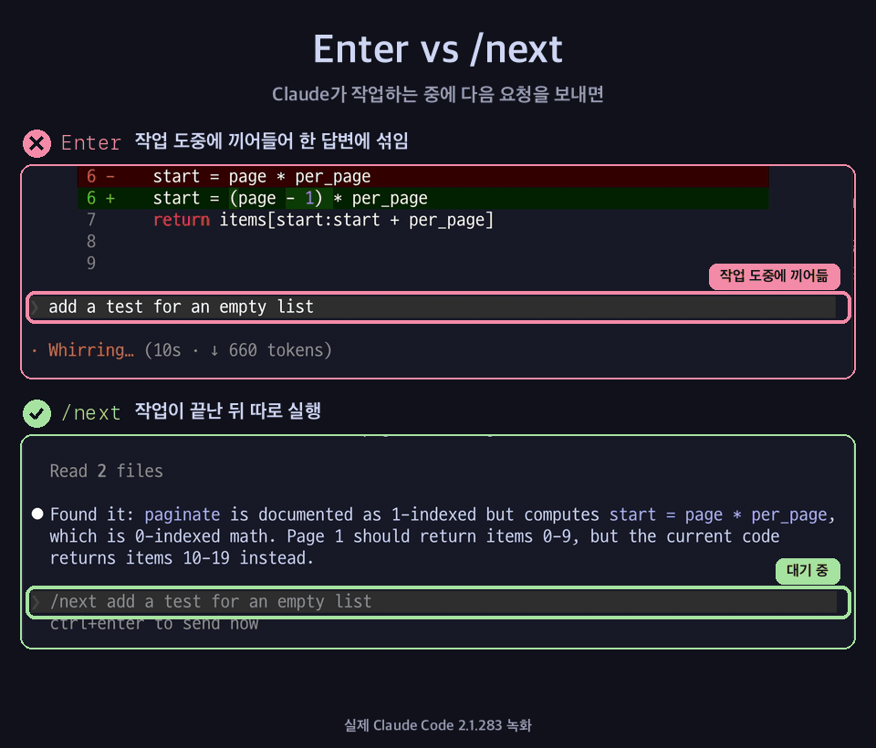

<div align="center">

# /next

**Claude Code가 작업하는 동안 다음 요청을 예약하세요. 지금 하는 작업은 방해하지 않습니다.**

[English](README.md) · 한국어 · [日本語](README.ja.md)



</div>

## 왜 필요한가

Claude가 작업을 절반쯤 하고 있는데 다음에 시킬 일이 벌써 떠올랐습니다. 입력하고 Enter를 누릅니다.

이 메시지는 기다려 주지 않습니다. Claude Code는 진행 중인 도구 호출이 끝나자마자, **작업 도중에** 이 메시지를 Claude에게 넘깁니다. Claude는 한 턴 안에서 두 요청을 한꺼번에 처리하게 되고, 답도 섞여서 나옵니다.

슬래시 명령은 다르게 처리됩니다. Claude Code는 명령을 **지금 턴이 끝날 때까지 보류**했다가, 넣은 순서대로 하나씩 실행합니다([공식 문서](https://code.claude.com/docs/en/interactive-mode#when-claude-code-sends-what-you-queued)). `/next`는 이 대기열을 활용하는 한 줄짜리 스킬입니다.

| Claude가 작업하는 중에 입력하면 | Claude에게 전달되는 시점 | 결과 |
|---|---|---|
| `릴리스 노트 써줘` ⏎ | 진행 중인 도구 호출 직후, **작업 도중** | 두 요청을 한 턴에서 함께 처리 |
| `/next 릴리스 노트 써줘` ⏎ | **턴이 끝난 뒤** | 순서대로, 별도의 턴으로 깔끔하게 실행 |

## 설치

클론 없이 한 줄로:

```bash
mkdir -p ~/.claude/skills/next && curl -fsSL https://raw.githubusercontent.com/Seokwoooo/claude-next/main/skills/next/SKILL.md -o ~/.claude/skills/next/SKILL.md
```

또는 클론한 뒤 링크로 연결합니다. 이러면 `git pull`만 하면 최신 상태가 유지됩니다.

```bash
git clone https://github.com/Seokwoooo/claude-next.git
cd claude-next && ./install.sh     # 제거: ./install.sh --uninstall
```

Windows에서는 [`skills/next/SKILL.md`](skills/next/SKILL.md)를 `%USERPROFILE%\.claude\skills\next\SKILL.md`로 저장하세요.

설치한 뒤 Claude Code 세션을 새로 열고 `/next`를 입력하면 됩니다.

## 사용법

```text
/next 전체 테스트를 돌리고 실패하는 게 있으면 고쳐줘
```

- **여러 개 예약하기.** `/next`마다 Enter를 따로 누르세요. 넣은 순서대로 각각 별도의 턴으로 실행되고, 앞의 요청이 도구 호출까지 전부 끝나야 다음 요청이 들어갑니다.
- **취소하거나 고치기.** 입력창이 비어 있을 때 `↑`를 누르면, 대기 중인 요청이 전부 입력창으로 돌아옵니다(한 줄에 하나씩). 필요 없는 줄을 지우고(`Ctrl+U`로 한 줄 삭제, 맥 터미널에서는 `Cmd+Backspace`도 가능) Enter를 누르면 나머지가 다시 예약됩니다. 입력창을 비워 두면 전부 취소됩니다.
  - Claude가 작업하는 중에 입력창을 지우려고 `Ctrl+C`를 누르지 마세요. 작업이 중단됩니다.
  - 다시 넣은 줄은 **하나의** 항목으로 합쳐집니다. 한 줄이면 문제없지만, 여러 개를 따로 실행하려면 하나씩 다시 넣으세요.
- **먼저 끝내기.** `Esc`로 지금 턴을 중단하면 예약해 둔 `/next`가 바로 실행됩니다.
- `/next`는 메시지 맨 앞에 있어야 명령으로 인식됩니다.

## 동작 원리

스킬 전체가 이게 다입니다.

```markdown
---
name: next
description: Queue a follow-up request that runs after the current turn finishes.
argument-hint: <next request>
disable-model-invocation: true
---

Treat the following as the user's follow-up request and carry it out now, continuing from the current conversation: $ARGUMENTS
```

- **기다리는 일은 스킬이 하지 않습니다.** Claude Code의 명령 대기열이 턴이 끝날 때까지 `/next`를 보류합니다. 스킬은 자기 차례가 왔을 때 요청을 넘겨줄 뿐이라, 따로 감시하거나 저장할 것이 없습니다.
- **사용자만 실행할 수 있습니다.** `disable-model-invocation: true` 덕분에 Claude는 스킬 목록에서 이 스킬을 볼 수 없고 스스로 호출하지도 못합니다. 설명문도 컨텍스트를 차지하지 않습니다.
- **컨텍스트를 최소한으로 씁니다.** 맨 위 설정 부분(frontmatter)은 Claude에게 전달되지 않습니다. `/next`가 실행되면 Claude가 받는 건 본문 한 줄과 사용자의 요청뿐입니다.
- 본문은 영어지만 요청은 입력한 언어 그대로 전달됩니다.

## 검증

[`tests/verify.sh`](tests/verify.sh)는 tmux 안에서 실제 대화형 Claude Code 세션을 띄웁니다. 여러 단계로 된 작업이 도는 동안 `/next` 두 개를 대기열에 넣고, 세션 기록을 읽어 무엇이 언제 Claude에게 전달됐는지 확인합니다.

```text
✓ first turn ended with FIRST_DONE
✓ both /next were queued during the first turn (2/2)
✓ neither /next reached Claude during the first turn (leaks: 0)
✓ the first /next used tools (2 tool calls)
✓ the second /next didn't reach Claude during the first /next (leaks: 0)
✓ each /next ran as its own turn (2/2)
✓ reply order: FIRST_DONE -> SECOND_DONE -> THIRD_DONE
PASS
```

Claude Code 2.1.283(macOS)에서 통과했습니다. 비교를 위해 일반 메시지를 같은 방식으로 넣어 보니 첫 도구 호출 직후에 바로 전달됐습니다. Claude Code를 업데이트한 뒤에는 `tests/verify.sh`를 다시 돌려 보세요. `tmux`와 `jq`가 필요하고, Haiku 기준으로 1분 정도 걸립니다.

## 한계

- "끝났다"는 건 **메인 턴이 끝났다는 뜻**입니다. Claude가 백그라운드로 돌려 둔 명령이나 에이전트는 아직 실행 중일 수 있습니다.
- 권한 확인은 그대로 적용됩니다. `/next`가 승인 절차를 건너뛰게 하지는 않습니다.
- 개인 스킬(`~/.claude/skills`)이라서 내 컴퓨터의 로컬 세션에서만 로드됩니다. 클라우드 세션에서는 쓸 수 없습니다.
- Claude Code의 명령 대기열에 기대는 방식입니다. 앞으로 버전이 바뀌어 동작이 달라지면 `tests/verify.sh`가 잡아냅니다.

## 라이선스

[MIT](LICENSE)
