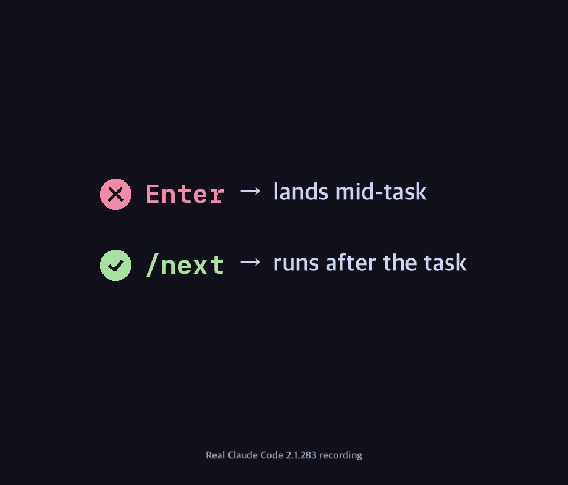

<div align="center">

# /next

**Queue your next request in Claude Code — without interrupting the one in progress.**

English · [한국어](README.ko.md) · [日本語](README.ja.md)



</div>

## Why

Claude is halfway through a task and you already know what comes next. You type it and press Enter.

That message doesn't wait. Claude Code hands it to Claude **as soon as the current tool call finishes, in the middle of the task**. Now Claude is juggling two requests in one turn, and the answers come back mixed.

Slash commands are handled differently. Claude Code **holds them until the turn ends**, then runs them one at a time, in the order you queued them ([docs](https://code.claude.com/docs/en/interactive-mode#when-claude-code-sends-what-you-queued)). `/next` is a one-line skill that uses that queue on purpose.

| While Claude is working, you type… | It reaches Claude… | What you get |
|---|---|---|
| `release note please` ⏎ | right after the current tool call, **mid-task** | both requests handled in one turn |
| `/next release note please` ⏎ | **after the turn ends** | a clean, separate turn, in order |

## See it for real

A real Claude Code 2.1.283 session in Ghostty: the same bug fix twice, once with a plain Enter and once with `/next`. Waiting stretches are sped up, and the badge in the corner shows by how much.



- **✕ Enter:** "add a test for an empty list" lands right after the fix, before the tests have even run. Claude handles both in one turn and answers them in one reply.
- **✓ /next:** the same request waits while Claude fixes the bug and runs the tests. Once that turn ends, it runs as a new turn of its own.

## Install

One line, no clone:

```bash
mkdir -p ~/.claude/skills/next && curl -fsSL https://raw.githubusercontent.com/Seokwoooo/claude-next/main/skills/next/SKILL.md -o ~/.claude/skills/next/SKILL.md
```

Or clone and link it, so `git pull` keeps it up to date:

```bash
git clone https://github.com/Seokwoooo/claude-next.git
cd claude-next && ./install.sh     # ./install.sh --uninstall to remove
```

On Windows, save [`skills/next/SKILL.md`](skills/next/SKILL.md) as `%USERPROFILE%\.claude\skills\next\SKILL.md`.

Then open a new Claude Code session and type `/next`.

## Usage

```text
/next run the full test suite and fix anything that fails
```

- **Queue several.** Press Enter after each `/next`. They run in order, each as its own turn, and each one waits until the previous one has finished, tool calls included.
- **Cancel or edit.** With the input box empty, press `↑`. Everything you queued comes back into the input box, one per line. Delete what you don't want (`Ctrl+U` clears a line, or `Cmd+Backspace` in macOS terminals), then press Enter to queue the rest again, or leave the box empty to cancel all of it.
  - Don't use `Ctrl+C` to clear the box while Claude is working. It interrupts the task.
  - Lines you queue again become **one** entry. That's fine for one line; for several, queue them one at a time.
- **Stop early.** `Esc` interrupts the current turn, and your queued `/next` runs right away.
- `/next` only works at the very start of a message.

## How it works

This is the whole skill:

```markdown
---
name: next
description: Queue a follow-up request that runs after the current turn finishes.
argument-hint: <next request>
disable-model-invocation: true
---

Treat the following as the user's follow-up request and carry it out now, continuing from the current conversation: $ARGUMENTS
```

- **The waiting isn't in the skill.** Claude Code's command queue holds `/next` until the turn ends. The skill only hands over your request when its turn comes, so there's nothing to poll, store or watch.
- **Only you can run it.** With `disable-model-invocation: true`, Claude never sees this skill in its list and can't call it on its own, and its description costs no context.
- **Minimal context.** The frontmatter isn't sent to Claude. When `/next` runs, Claude gets that one line plus your request.

## Verified

[`tests/verify.sh`](tests/verify.sh) starts a real interactive Claude Code session in tmux, queues two `/next` commands while a multi-step task is running, and reads the session transcript to check what reached Claude and when:

```text
✓ first turn ended with FIRST_DONE
✓ both /next were queued during the first turn (2/2)
✓ neither /next reached Claude during the first turn (leaks: 0)
✓ the first /next used tools (2 tool calls)
✓ the second /next didn't reach Claude during the first /next (leaks: 0)
✓ each /next ran as its own turn (2/2)
✓ reply order: FIRST_DONE -> SECOND_DONE -> THIRD_DONE
PASS
```

Passes on Claude Code 2.1.283 (macOS). As a control, a plain message queued the same way was delivered right after the first tool call. After updating Claude Code, run `tests/verify.sh` again (needs `tmux` and `jq`, about a minute on Haiku).

## Limits

- "Done" means **the main turn ended**. Background commands or agents Claude started may still be running.
- Permission prompts still apply. `/next` doesn't skip any approvals.
- It's a personal skill (`~/.claude/skills`), so it loads in local sessions on your machine but not in cloud sessions.
- It relies on Claude Code's command queue. If a future version changes that behavior, `tests/verify.sh` will catch it.

## License

[MIT](LICENSE)
